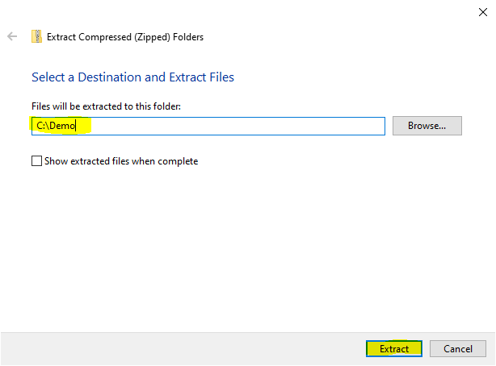

# 2401PTDS_Regression_Project

  

## Table of contents
* [1. Project Overview](#project-description)
* [2. Dataset](#dataset)
* [3. Packages](#packages)
* [4. Cloning the repo](#cloning-repo)
* [5. Environment](#environment)
* [6. Team Members](#team-members)

## 1. Project Overview 
Your team of environmental consultants and data scientists are tasked by a coalition of agricultural stakeholders to analyse and predict the effect of CO2 emissions on climate change from the agri-food sector. The stakeholders include policymakers, agricultural businesses, and environmental organisations. Your project aims to understand the impact of agricultural activities on climate change and develop strategies for sustainable practices. Utilising a comprehensive dataset compiled from the Food and Agriculture Organization (FAO) and the Intergovernmental Panel on Climate Change (IPCC), you will explore various emission sources, perform regression analysis to predict temperature variations, and offer actionable insights for the stakeholders.

By the end of this project, you will have a thorough understanding of the impact of agricultural activities on CO2 emissions and climate change. Your findings and recommendations will contribute to the ongoing efforts to promote sustainability within the agri-food sector, providing valuable insights for the stakeholders involved in this initiative.

## 2. Dataset 
Emissions from the agri-food sector play a crucial role in climate change, as they represent a significant share of global annual emissions. The dataset highlights the substantial contribution of the various sources of emissions. Therefore, it is essential to understand and address the environmental impact of the agri-food industry to mitigate climate change and promote sustainable practices within this sector.

**Dataset Features:**
- Savanna fires: Emissions from fires in savanna ecosystems.
- Forest fires: Emissions from fires in forested areas.
- Crop Residues: Emissions from burning or decomposing leftover plant material after crop harvesting.
- Rice Cultivation: Emissions from methane released during rice cultivation.
- Drained organic soils (CO2): Emissions from carbon dioxide released when draining organic soils.
- Pesticides Manufacturing: Emissions from the production of pesticides.
- Food Transport: Emissions from transporting food products.
- Forestland: Land covered by forests.
- Net Forest conversion: Change in forest area due to deforestation and afforestation.
- Food Household Consumption: Emissions from food consumption at the household level.
- Food Retail: Emissions from the operation of retail establishments selling food.
- On-farm Electricity Use: Electricity consumption on farms.
- Food Packaging: Emissions from the production and disposal of food packaging materials.
- Agrifood Systems Waste Disposal: Emissions from waste disposal in the agrifood system.
- Food Processing: Emissions from processing food products.
- Fertilizers Manufacturing: Emissions from the production of fertilizers.
- IPPU: Emissions from industrial processes and product use.
- Manure applied to Soils: Emissions from applying animal manure to agricultural soils.
- Manure left on Pasture: Emissions from animal manure on pasture or grazing land.
- Manure Management: Emissions from managing and treating animal manure.
- Fires in organic soils: Emissions from fires in organic soils.
- Fires in humid tropical forests: Emissions from fires in humid tropical forests.
- On-farm energy use: Energy consumption on farms.
- Rural population: Number of people living in rural areas.
- Urban population: Number of people living in urban areas.
- Total Population - Male: Total number of male individuals in the population.
- Total Population - Female: Total number of female individuals in the population.
- total_emission: Total greenhouse gas emissions from various sources.
- Average Temperature °C: The average increasing of temperature (by year) in degrees Celsius,
 

CO2 is recorded in kilotonnes (kt): 1 kt represents 1000 kg of CO2.

The feature "Average Temperature C°", represents the average yearly temperature increase. For example, if it is 0.12, it means that the temperature in that specific location increased by 0.12 degrees Celsius.

Forestland is the only feature that exhibits negative emissions due to its role as a carbon sink. Through photosynthesis, forests absorb and store carbon dioxide, effectively removing it from the atmosphere. Sustainable forest management, along with afforestation and reforestation efforts, further contribute to negative emissions by increasing carbon sequestration capacity.

## 3. Packages 

To carry out all the objectives for this repo, the following necessary dependencies need to be loaded. Take note that these dependencies will be loaded when following the guides provided below in [5. Environment](#environment) section:
+ `pandas 2.1.4`
+ `numpy 1.26.4`
+ `seaborn 0.13.2`
+ `matplotlib 3.9.0`
+ `matplotlib-inline 0.1.6`

Alternatively, you can also ensure these dependencies are installed when running the notebook file's Chapter 2 section.
 
## 4. Cloning the repo 

The below section will provide a guide on methods to follow to illustrate how to clone the repo found in this project, allowing the user to run all the notebook files contained therein.

### Clone the repo using Donwload as ZIP and extracting the ZIP folder

1. On the `GitHub` landing page, once this repo is open, make sure you can see `main` at the branch select drop-down. Click on this branch select drop-down and make sure `main` is selected.

2. Click on the `<> Code` button. Click on the `Local` tab. Click on the `Download as ZIP` button. This will now download the entire repo from the `main` branch onto your machine and store it in your `Downloads` folder directory.

3. Create a new directory on your local machine at any location of your choice. This will be the folder location you will use to extract the ZIP folder containing the repo. The suggestion is to use location path <a class="anchor" id="directory">`C:\Demo`</a>. This will create a folder name of your choice in your local C Drive directory. `Demo` is for illustrative purposes, but it can be any folder name you choose.

4. Navigate to your `Downloads` folder and right-click on the file named `moosa-and-the-pips-main.zip`. Click on `Extract All...`.

5. When the `Extract Compressed (Zipped) Folders` wizard opens, type <a class="anchor" id="directory">`C:\Demo`</a> in the text box beneath `Files will be extracted to this folder:`. Click on `Extract` button.

6. Navigate back to your local file directory <a class="anchor" id="directory">`C:\Demo`</a> created earlier. Note that a file called `moosa-and-the-pips` have appeared in your previously empty local directory <a class="anchor" id="directory">`C:\Demo`</a> folder. Double-click on this folder to open it.

7. Note that everything that is currently on the `main` branch of this repo is now also on your local machine

## 5. Environment 

It's highly recommended to use a virtual environment for your projects, there are many ways to do this; we've outlined one such method below. Make sure to regularly update this section. This way, anyone who clones your repository will know exactly what steps to follow to prepare the necessary environment. The instructions provided here should enable a person to clone your repo and quickly get started.

## Setting up the coding environment
The below section details how to recreate the coding environment necessary to run all the Jupyter Notebook files contained in this project. Three (3) methods will be discussed below to assist with setting up the necessary coding environment.

### Set-up using Python and CMD (Command prompt)

**Note:** For this method, the only installation you will need to do before creating the environment is to install the latest version of `Python` on your local machine that you plan to use to run the Notebook files.

1. Ensure you have the latest version of `Python` installed (as of writing on 12-08-2024, the latest version was 3.12.5). The latest version of `Python` can be found by clicking here: <a href="https://www.python.org/downloads/">Python</a>. Click on Download 3.12.5 and follow the prompts to ensure `Python` is installed on your machine.

2. Click on `Start` menu

3. Type `Command prompt` in the search bar

4. Click on `Open` in the Command prompt menu that appears in the search results. (**NOTE:** You may need to select `Run as administrator`)

5. CMD opens up

6. Type the command `cd C:\Users`. Press `Enter`. **Note:** you can use any path you wish here, using `C:\Users` for demo purposes, but you will most likely use the path <a class="anchor" id="directory">`C:\Demo`</a> you created earlier when you cloned the repo.

7. Type the command `py -m venv .Explore`. Press `Enter`.

8. Wait for the command to finish running. You will know it is done when you are able to see the command prompt flashing again. Also take note that in your local directory where your repo is stored, there will be a new folder called `.Explore`

9. Type the command `.Explore\Scripts\activate`. Press `Enter`.

10. Wait for the command to finish running. You will notice that your command prompt now has `(.Explore)` prepended to it. You have now activated this new environment created earlier.

11. Type the command `pip install jupyter`. Press `Enter`.

12. Please be patient as this command will install Jupyter Notebook in your newly created `.Explore` environment. Take note that this installation could take a few minutes to complete - remain patient. Jupyter Notebook is what will be used to display our notebooks and run all the code contained within.

13. The installation will show the message `Installing collected packages:` while it is busy installing the Jupyter packages in the CMD.

14. The installation will complete when the message `Successfully installed` is displayed. The cursor will also return to your CMD to allow you start typing again.

15. Type the command `pip install -r requirements.txt`. Press `Enter`. **NOTE:** It is critical that the `requirements.txt` file is located in your directory <a class="anchor" id="directory">`C:\Demo`</a> where you cloned your repo as well as where you are currently creating your environment. If the file is not present, no installation of the required packages will take place.

16. Please be patient as this command will install all the required packages to run all the code contained in the Notebooks on this repo in your newly created `.Explore` environment. Take note that this installation could take a few minutes to complete - remain patient. The `requirements.txt` file contains the package name and package version that will be needed to the run necessary code and must be installed for this environment to function properly when running code from the notebooks.

17. The installation will show the message `Installing collected packages:` while it is busy installing the packages contained in the `requirements.txt` file in the CMD.

18. The installation will complete when the message `Successfully installed` is displayed. The cursor will also return to your CMD to allow you start typing again.

19. Type the command `jupyter notebook`. Press `Enter`.

20. This command will launch a new instance of Jupyter Notebook on your local default browser of choice and open Jupyter Notebook environment inside the directory <a class="anchor" id="directory">`C:\Demo`</a> where you have cloned your repo. Please be patient as this can take a few seconds.

21. Please take note that once you see Jupyter Notebook open up in your browser, you are free to start browsing for and opening all Notebook files in this project and have successfully created a new virtual environment.

## 6. Team Members

| Name                                                                                        |  Email              
|---------------------------------------------------------------------------------------------|--------------------             
| [Robert Breedt](https://github.com/Robert-Breedt)                                           | breedtrobert@yahoo.com
| [Lindelwa Ndhlovu]()                                                                        | 
| [Christiaan De Beer](https://github.com/Christiaandebeer1986)                               | debeerchristiaan@gmail.com 
| [Philani Hlengwa](https://github.com/Philani-Hlengwa)                                       | senzo.philani@gmail.com
| [Nomvunulo Mpontshane](https://github.com/Nomvunulo-Mpontshane)                             | nomvunulom@gmail.com

#### Additional Resources to create a README file:
- [Make a README](https://www.makeareadme.com/)
- [GitHub Docs](https://docs.github.com/en/repositories/managing-your-repositorys-settings-and-features/customizing-your-repository/about-readmes)
- [FreeCodeCamp](https://www.freecodecamp.org/news/how-to-write-a-good-readme-file/)
